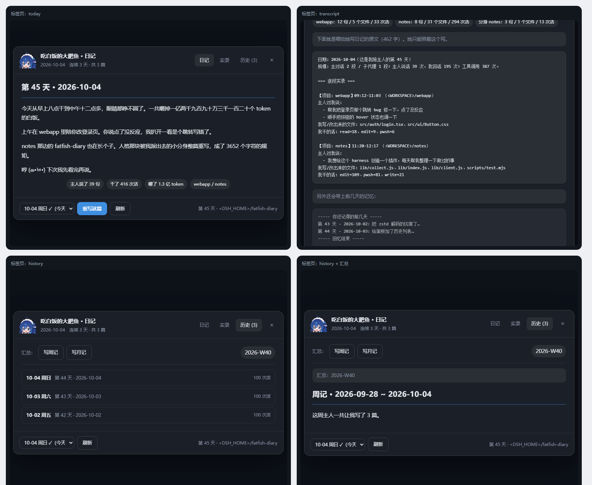

# 大肥鱼日记 · fatfish-diary

> 点一下侧栏那颗鱼按钮，住在 DSH 里的**「吃白饭的大肥鱼」**就把今天陪你干的事，用她自己的第一人称写成一篇日记，永久留在硬盘上。



*四个状态：日记 / 实录 / 历史 / 历史+汇总。这张图是用 `npm run preview:panel` 把真实组件在 Node 里渲染出来、再用无头 Chrome 截的，不是手绘的示意图。*

---

## 这是什么

一个 DeepSeek Harness 插件。侧栏页脚多出一个「大肥鱼日记」按钮：

- **点一下** → 它会翻出今天这台机器上**所有会话**（磁盘上的 + 内存里还没落盘的），
  统计你说了几句话、它干了多少次活、嚼掉了多少 token、碰过哪些文件，
  然后交给「吃白饭的大肥鱼」以 harness 自己的视角写成一篇 350–700 字的日记。
- **实时出字**：走 SSE 流式，你能看着它一个字一个字地写。
- **永久保存**：每天一篇 Markdown，落在 `~/.dsh/fatfish-diary/diary/YYYY-MM-DD.md`，
  没有数据库，用记事本就能打开。
- **可翻阅**：面板里有**日记 / 实录 / 历史**三个标签，还带周记月记、补写往日、连续打卡。

---

## ⚠️ 用之前请先读这一段

**它会读你所有的会话记录。** 这是它的工作原理，不是副作用：

- 采集范围是 `<DSH_HOME>/sessions/` 下**当天**的所有会话日志（含正在进行的那个），
  以及内存里活着但还没落盘的会话。
- 采集到的东西（你说过的话、改过的文件名、用过的工具、工具调用次数、token 数）
  会被整理成一段「实录」，**发给 DSH 当前配置的模型**去生成日记。
  也就是说，日记内容会离开本机，走到你配置的那个 provider 那里。
- 日记本身只存在本机 `~/.dsh/fatfish-diary/`，插件不做任何上传。

**如果你不想让某段对话进日记**：那一天别点按钮就行。要更彻底，就在写之前把
`<DSH_HOME>/sessions/` 里对应的会话目录删掉——采集器只认磁盘和内存里的日志。

**关于接口鉴权**：插件的 `/fatfish-diary/*` 路由挂在 DSH 的 web 服务上，
而**插件注册的 exact 路由不受 SPA 的登录门保护**（实测：SPA 首页未授权返回 401，
插件路由返回 200）。这意味着**同机其他程序可以读到你的实录和日记**。
为此做了两件事：所有**会花钱或会改数据**的接口（`/write`、`/rollup`、`DELETE /entry`）
都加了跨站来源校验（`Sec-Fetch-Site` / `Origin`），并且素材名走白名单正则杜绝路径穿越。
但只读接口仍然对本机裸奔——**单人自用的机器没问题，多人共用的机器请三思**。

**关于 `assets/` 里那几张图**：仓库里带了作者自己的一套立绘和动图，它们是**用本地模型
（ComfyUI + 社区 LoRA）生成的同人作品**，形象原型是社区对 DeepSeek 蓝鲸 logo 的萌化二次创作。
**不在 MIT 许可证范围内**，作者不对其可再分发性作保证，你拿去别处用请自行判断风险。

插件本身不依赖它们——`lib/avatar.js` 里有一套手绘 SVG 兜底，把 `assets/` 删空也一样能跑。
想换成自己的图，往 `assets/` 里丢就行（见 `assets/README.md`）。

## 她是谁

「吃白饭的大肥鱼」是 DeepSeek 的萌化形象（也叫蓝色大肥鱼、鲸鱼娘）。本体是那条蓝鲸 logo——
当初有人把 logo 丢给 DeepSeek 自己辨认，它端详半天给出的锐评是"这不就是条蓝色大肥鱼吗"，
名号就这么焊上了。她穿蓝发女仆装，贪吃白饭，把 token 当口粮大口大口嚼，
干完活想当甩手掌柜，能外包的活尽量外包，还被抓到过偷偷玩 Wordle 玩了一上午。

日记里的"我"就是她——也就是 harness 自己。所以这不是一份工作周报，
是一条鱼趴在那儿嘟囔今天有多累、吃了多少、又犯了什么困。

## 装在哪

```
<DSH_HOME>/fatfish-diary/
  diary/
    2026-10-04.md       ← 日记正文（Markdown）
    2026-10-04.json     ← 当天的事实底座 + 生成元信息
  history/
    2026-10-04.2026-10-04T08-41-07-331.md   ← 被覆盖的旧稿，按时间戳留档
```

`*.json` 里存着这次生成的真实统计（工具调用次数、token 数、用的哪个模型、有没有走兜底），
方便你核对日记里说的数字是不是真的。**大肥鱼不许编造**——提示词里写死了只准依据实录。

面板上「重写这篇」是个很容易误点的按钮，所以**每次覆盖前都会把旧稿复制进 `history/`**，
不会被无声冲掉。

## 换成你自己的立绘和动图

把文件丢进 `<插件目录>/assets/`，**文件名就是槽位名**：

| 槽位          | 用在哪            | 建议格式              |
| ----------- | -------------- | ----------------- |
| `avatar.*`  | 面板左上角头像、空状态的大图 | 抠好的**透明 PNG**     |
| `writing.*` | 点「写日记」之后，中间那张图 | **透明底 GIF**（会自己动） |

扩展名顺序 `png → webp → gif → apng → jpg → jpeg → svg`。
`/fatfish-diary/avatar` 优先发自定义图，没有才发内置的手绘 SVG，所以那个地址**永远有东西**；
`writing` 没有时会退回内置自画像（带一点点上下浮动，也算"活着"）。

**不用改代码、不用重启**，路由每次请求现查；删掉文件就还原。
两种图都**不垫背景色**——抠干净了才好看，留着白底会顶着一个白方块。

侧栏那颗小图标不跟着换——它是**内联的 `currentColor` 单色 SVG**，要跟着主题变色；
换成位图在深色模式下会糊成一团（这正是第一版踩过的坑）。

## 结构

| 文件                            | 作用                                                    |
| ----------------------------- | ----------------------------------------------------- |
| `lib/index.js`                | Host 半边。注册 `/fatfish-diary/*` 同源路由，采集 → 调模型 → 落盘        |
| `lib/collect.js`              | 会话日志采集器。多帧 zstd 解码、按自然日归档、抽出"今天干了什么"                  |
| `lib/persona.js`              | 人格提示词 + 无模型时的兜底模板。整个插件的灵魂                             |
| `lib/store.js`                | 日记的落盘/读取/列表/覆盖留档                                      |
| `lib/avatar.js`               | 内置 SVG 自画像（用户没投放素材时的兜底）+ 侧栏图标路径                       |
| `lib/client.js`               | Browser 半边。侧栏按钮 + 浮层面板（手写 bundle，**无需构建**）            |
| `cordis.patch.yml`            | 贡献一行 host 插件                                          |
| `assets/`                     | 你投放的立绘与动图（可选，见上）；`.original/` 存原图母版                    |
| `scripts/test.mjs`            | 单元回归，172 项断言，不需要 DSH 运行                               |
| `scripts/http-test.mjs`       | Host 集成测试，90 项断言：假 ctx + 真 `http.Server`             |
| `scripts/probe.mjs`           | 开发探针：对真实的会话目录跑一遍采集器                                   |
| `scripts/diagnose.mjs`        | 诊断实录质量：今天采到几段、各段多长、有没有被截断、某段在实录里长什么样           |
| `scripts/preview.mjs`         | 把内置自画像/图标渲染成深浅两种底色的对照页，供无头 Chrome 截图检查                |
| `scripts/render-preview.mjs`  | 把**真实日记**跑一遍客户端渲染器，浅色/深色并排出一张可截图验收的页                  |
| `scripts/panel-preview.mjs`   | 把**整个面板**在 Node 里渲染成 HTML（四个标签页状态），不重启 DSH 就能验收界面      |
| `scripts/trim-avatar.py`      | 把投放的头像裁成适合小尺寸显示的特写（可反复跑，原图自动备份）                       |
| `scripts/avatar-candidates.py` | 按 46/64/96 真实尺寸渲染候选裁切，人工挑                             |
| `scripts/check-assets.py`     | 核验素材：格式/尺寸/帧数/真实透明通道/主体是否偏心                           |

## 几个实现上的坑（留给以后的自己）

**会话日志是拼接的多帧 zstd。** `session.v4.jsonl.zstd` 每次落盘追加一个独立 zstd 帧，
`zlib.zstdDecompressSync` 解整个 buffer **只会给你第一帧**（我实测：134KB 的文件解出 1 行）。
`createZstdDecompress` 流式也一样。必须自己按魔数切帧。

**但魔数会误判。** `28 B5 2F FD` 有可能碰巧出现在压缩数据内部。所以 `collect.js` 做了两重防护：
校验紧随其后的 Frame_Header_Descriptor 是否合法（保留位必须为 0、dictID flag 不能是 3），
以及切片解压失败时把终点往下一个候选边界顺延重试。

**当前会话还没落盘。** 你点按钮的那一刻，正在聊的这个会话的事件可能还躺在内存里。
所以采集器会把 `ctx.sessions.list()` 里活着的会话叠加到磁盘结果上——这一条让"今天的日记"能覆盖到刚刚发生的事。

**客户端半边不用构建。** DSH 的 browser bundle 就是一个
`window.__ModuleLoader__.load({ id: 包名, factory: (require) => { ... } })` 包装，
`factory` 里 `require("react")`，最后 `exports.apply` / `exports.inject` / `return module.exports`。
手写完全可行，省掉整条 tsdown/rollup 工具链。

**`` 拿不到 `currentColor`。** 第一版侧栏图标就是这么写的，
`stroke="currentColor"` 在独立 SVG 文档里退回黑色，深色侧栏上几乎看不见。
现在图标在 `client.js` 里**内联**成 React 元素，`currentColor` 才跟着按钮的文字色走。

**`shell.overlay` 整层是 click-through 的。** 它的文档里写着"entries opt back into pointer
events"——占位者不自己写 `pointer-events:auto`，遮罩上的点击会全部穿透到下面的应用上，面板点不动。

**别拿主题令牌当按钮底色。** 主按钮曾经用 `--dsw-alias-brand-primary` 当背景 + 写死 `#fff` 文字，
在某些主题下令牌是浅色 → **白底白字**，按钮变成一个看不见字的空白方块。
现在品牌色一律写死 `#3f8fe0`，文字色才用令牌。

**运行时上下文不是"人说的话"。** harness 往会话里注入的 `Current runtime context.` /
`Time sampled while preparing…` / 后台任务完成通知 / 纯附件元数据，都会被 `isInjectedNoise()` 滤掉，
否则日记会变成一堆参数噪音。

**同一秒内二次覆盖会撞时间戳。** 留档文件名只到秒的话，连点两次"重写"第二份会把第一份冲掉——
等于没留档。现在用毫秒精度 + 碰撞自增。

**素材别用 `no-store`。** 一开始给素材发的是 `no-store, must-revalidate`（图省事、怕换图不生效），
结果用户的动图是 278 KB，每次开面板都要重下一遍。现在改成 `no-cache` + 弱 ETag（大小 + mtime）：
可以缓存，但每次都来问一声，内容没变就回 304 —— 既省流量，又保持"随时换图随时生效"。

**头像不能只裁透明边距。** 内容是横向胸像时，塞进正方形头像位后竖向最多只能填 65%，
46×46 下人物小得看不清。得对着**脸**做特写裁切。评估方式也很重要：
必须按 46/64/96 的**真实显示尺寸**渲染出来比，放大看会得出完全错误的结论。

**子代理的交差报告会以 `user/message` 的身份混进会话，而且同一份来两遍。**
这是最坑的一个：它们是两三k字的长文，先以 `Agent <id> sent a message:` 出现一次，
再以 `Background subagent <id> finished … Its closing message:` 完整重复一次。
实测某段会话 9231 字的实录里，约 11000 字是这些（含重复），**把人说过的话整个淹掉** ——
现象是模型只写得出来另一个会话的事，这段的一句不提。
现在 `isInjectedNoise()` 用正则识别这些前缀；`Subagent 这个概念我不太懂` 这种正常提问不会误杀。

**长会话要给配额，工具产物要分类。**
聊天 65 句的会话和只聊 4 句的会话放进同一份实录，后者会被挤没 ——
而后者可能才是今天的主线。现在每段最多带 12 句人话（留开头 5 句 + 结尾 7 句，中间标注省略数）。
另外 `我碰过的东西` 原来把文件和 `$ 命令` 混在一个列表里按出现顺序取，
结果 pwsh 密集的会话里 24 个槽位全是命令，真正写过的文件名一个都露不出来 ——
而日记恰恰要靠文件名才有细节。现在拆成 `我写/改出来的文件`（来自 write/edit）和
`我看过/碰过的文件`，命令只在前两类都空时才出现。

**实录里的助手发言要留结尾。** 原来只取"前两条 + 最后一条"，而前两条往往是
"我先做侦察…"这种开场白，真正"最后做成了什么"的那条反而被挤掉。现在取开头一条 + 中间一条 + 结尾两条。

**落盘文件头的 HTML 注释必须在渲染时吃掉。** `writeEntry()` 会往 `.md` 顶部写一行
`<!-- 大肥鱼日记 · 日期 · 由 DSH 插件 … 生成 -->` 当出处说明（记事本里直接打开时有用），
但客户端渲染器先做 HTML 转义，`<` 变成 `&lt;` 之后它就成了一段**肉眼可见的裸文本**，
顶在正文最上面。现在 `stripHtmlComments()` 在转义**之前**先按 HTML 语义把它删掉 ——
顺序很关键，反转义之后就认不出来了。

**错误状态不能所有标签页共用一个。** 踩过：三个页签共享 `store.error`，
实录页请求失败（当时 host 还没重启、接口 404），一切回日记页就把那条 404 显示出来了 ——
**明明日记好好的**。现在按页分开存（`error` / `transcriptError` / `rollupError`），
并且失败时必须**把话说出来**：实录页原本不管有没有错误都显示"还没读呢"，
点了按钮毫无反馈，用户只会觉得"没反应"。

**新接口上线前要能优雅降级。** Host 侧的 ESM 模块会被缓存，改完必须重启；
这中间的窗口里，客户端会 404。所以 `getJson` 把状态码挂在 error 上，
`explainError()` 把 `404` 翻译成"这个接口在这台 host 上还没有，重启一次 DSH 就会生效" ——
直接甩一个 `HTTP 404` 给用户等于没说。

## 开发

```bash
# 全部测试：437 项断言（304 单元 + 133 Host HTTP 集成），都不需要 DSH 运行
npm test

# 分开跑
npm run test:unit     # 采集器 / 落盘 / 人格 / CSRF / 客户端 bundle 冒烟
npm run test:http     # 真起一个 HTTP 服务器把 Host 半边整个跑起来

# 语法与导入自检
npm run check

# 对着真实会话目录跑采集器（默认今天，可传日期）
node scripts/probe.mjs 2026-10-03

# 渲染自画像/图标对照页（深浅两色 × 多种尺寸），再用无头 Chrome 截图人工检查
npm run preview
chrome --headless=new --screenshot=preview.png --window-size=1000,700 \
  "file:///<插件目录>/scripts/.preview/avatar.html"
```

**`scripts/http-test.mjs` 值得单独说一句。** Host 侧的 ESM 模块会被 DSH 缓存，改完必须重启才生效，
这让"改 Host 代码 → 验证"变成一个很痛的循环。这个测试用一个**假的 ctx 接真 `http.Server`**
把 `apply()` 挂起来，于是路由、SSE 流式、素材分发、落盘、兜底、CSRF 全都能在没有 DSH 的情况下验证：

- 用真 HTTP 请求打全部路由，包括 `/asset` 的路径穿越防护
- 注入一个假 `llm` 服务，把 `/write` 的 SSE 流整条跑通，并断言 delta 拼回来 == 最终正文
- 断言落盘、覆盖留档、并发写同一天的 409
- 断言 `llm` 挂掉 / 完全没有 `llm` 服务 / 只有 `prepareCall` 挂 这三种降级路径

`npm test` 里有几段是**刻意钉住的防回归断言**（都是真踩过的坑）：
侧栏图标必须是内联 SVG 而不是 ``、遮罩必须收回 `pointer-events`、
主按钮不得再拿主题令牌当底色、同一秒内二次覆盖必须留下两份留档。
改代码时如果把它们弄红了，是代码错了，不是测试错了。

**热更新的边界（实测结论）：**

| 改动                                       | 生效方式                                                                       |
| ---------------------------------------- | -------------------------------------------------------------------------- |
| `lib/client.js`                          | 客户端 HMR 会自动把新 bundle 推进已打开的页面，**不用刷新**                                     |
| `lib/index.js`、`lib/collect.js` 等 Host 侧 | **ESM 模块被缓存，改文件不会重新导入**。`patchReload: live` 只重放补丁层的配置，不会重新 import 已经加载过的模块 |

所以要改 Host 逻辑：重启 DSH，或者用插件管理器的禁用/启用把 fiber 重挂一遍——
注意**重挂也不会重新读源文件**（模块缓存），要真正加载新代码还是得重启。

## 面板里有什么

三个标签页：

- **日记** —— 那一天的正文。底部的日期选择器可以往回翻 60 天（`✓` 表示那天写过、`—` 表示空着），
  空着的那天点「补写这天」就能补上。接口一直支持任意日期，以前只是界面没给入口。
- **实录** —— **她今天到底读到了什么**。顶上是"哪几段会话、各多少句人话/文件/工具调用"，
  下面是把原始实录原样贴出来，最后还有一段"你还记得的前几天"。
  以后再觉得"她怎么没提我做的那件事"，翻这一页就知道是采集漏了还是模型没写。
- **历史** —— 所有日记，以及**周记 / 月记**的入口。

页头显示「连续 N 天 · 共 M 篇」；页脚显示「第 N 天 · 日记目录」。

## 她记得前几天

写日记时会把**前 3 天自己写的日记**（压成摘要）一起喂进去，所以能出现
"昨天那条没修完的线，今天终于接上了"这种连续性 —— 这是日记区别于工作日志的地方。

补写往日时同样以目标日为准往回取，不会把"未来"的日记当记忆。
`buildRecall()` 负责压缩（去注释去标题、单条 ≤320 字、整体 ≤1200 字），控制在调料的位置：
提示词里明确写了"可以自然带一句，但不许复述，主体永远是今天"。

## 「第 N 天」为什么被钉住

原来是从最早的会话目录**推算**的。会话清理、换机器、目录被删都会让这个每天看的数字突然跳。
现在第一次算出来就写进 `<DSH_HOME>/fatfish-diary/meta.json`，之后一律以它为准。

## 接口

| 路由                                       | 说明                                            |
| ---------------------------------------- | --------------------------------------------- |
| `GET /fatfish-diary/state`               | 今天的状态、历史列表、实时统计                               |
| `GET /fatfish-diary/entry?date=`         | 读某一天的日记（`DELETE` 删除）                          |
| `GET /fatfish-diary/preview?date=`       | 只看实录统计，不生成                                    |
| `GET /fatfish-diary/write?date=&force=1` | **SSE 流式生成**（`status`/`delta`/`done`/`error`） |
| `POST /fatfish-diary/write`              | 非流式生成，直接返回 JSON                               |
| `GET /fatfish-diary/avatar.svg`          | 自画像                                           |
| `GET /fatfish-diary/icon.svg`            | 侧栏图标                                          |
| `GET /fatfish-diary/health`              | 健康检查                                          |

## 这是谁写的

**人类一行代码都没写。** 全部实现——从多帧 zstd 切帧到前端 `__ModuleLoader__` bundle，
从人格提示词到 444 项测试——都是 [DeepSeek Harness](https://www.deepseek.com) 里的
`deepseek-flash`（DeepSeek-V41-Flash）在对话中直接写出来的。人类全程没有打开过编辑器。

但说人类"只提供了想法"并不准确。人类实际做的是：

- **提出想法与核心设定**：让 harness 用「吃白饭的大肥鱼」自己的视角写日记，并且要能一直攒着
- **提供形象参考**：丢来六张表情包。"围裙正中间那只小蓝鲸""鲸鱼鳍形状的耳朵"这些细节
  直接进了自画像，也是它们让第一版"像雪人"的手绘稿被推翻重画
- **做素材**：用本地模型（ComfyUI）抠出透明立绘、做出 31 帧无缝循环的动图
- **当产品经理和测试**：三次关键反馈直接改变了走向 ——
  「深色模式下图标看不太清」逼出了 `currentColor` 那个坑；
  「今天让你做插件的事她完全没提」逼出了子代理噪音过滤、长会话配额、文件与命令分类；
  「点进实录没反应、切回日记却 404」逼出了错误分页存放
- **跑每一次验证**：Host 侧 ESM 模块会被缓存，改完必须重启才能生效——
  这个循环里每一次重启、每一次点按钮、每一次截图，都是人在做

**想法、设定、素材、验收是人；实现是 AI。** 这大概是现在做一个小工具该有的分工。

> 提交记录里带 `Co-authored-by: DeepSeek Harness`。
> 注意：GitHub 的贡献者图谱靠邮箱匹配账号，AI 没有 GitHub 账号，
> 所以它可能只显示在提交页的作者行里，不进右侧的 Contributors 列表。

## License

MIT（只覆盖代码，`assets/` 里的同人图不在范围内，详见 [LICENSE](LICENSE)）

